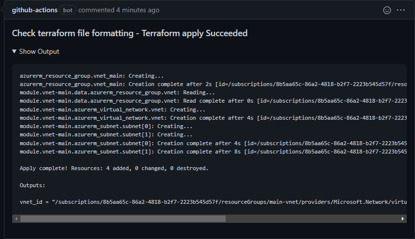

# Terraform Apply action

This is one of a suite of terraform related actions.

This action uses the `terraform apply` to apply a terraform plan. If the plan is not found, then the apply action will fail. This is to ensure that the action only applies changes that have been reviewed by a human. 

If the triggering event relates to a PR, it will add a comment on the PR containing the changes.'

## Inputs

* `GitHub_Token`

  GitHub Token used to authenticate on behalf of GitHub Actions.. 

  - Type: string
  - Required

```yaml
        with:
          GitHub_Token: ${{ secrets.GITHUB_TOKEN }}
```

* `Plan`

  Plan generated from another GitHub Action from which `terraform apply` will execute the planned changes.
  - Type: string
  - Required

```yaml
        with:
          Plan: terraform.tfplan
```

## Example usage

This example workflow runs on pull request and fails if terraform apply failed.

```yaml
name: Apply terraform plan

on:
  pull_request:

jobs:
  TerraformPlan:
    runs-on: ubuntu-latest
    name: Apply terraform plan
    steps:
      - name: Checkout
        uses: actions/checkout@v3

      - name: terraform init
        id: init
        run: terraform init

      - name: terraform apply
        id: apply
        uses: benyboy84/github-action-tf-apply@v1.0.0
        with:
          GitHub_Token: ${{ secrets.GITHUB_TOKEN }}
          Plan: terraform.tfplan
```

## Screenshots


